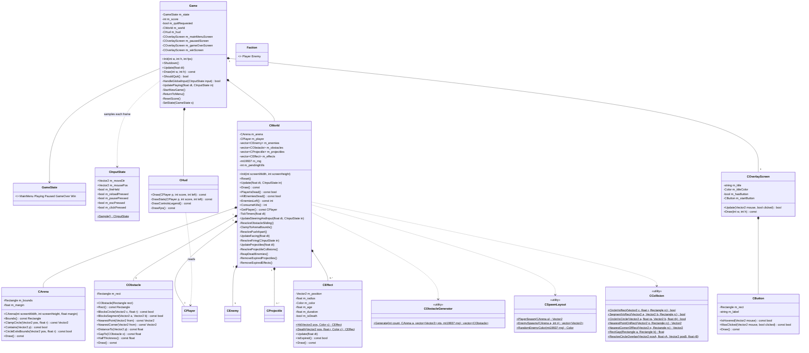
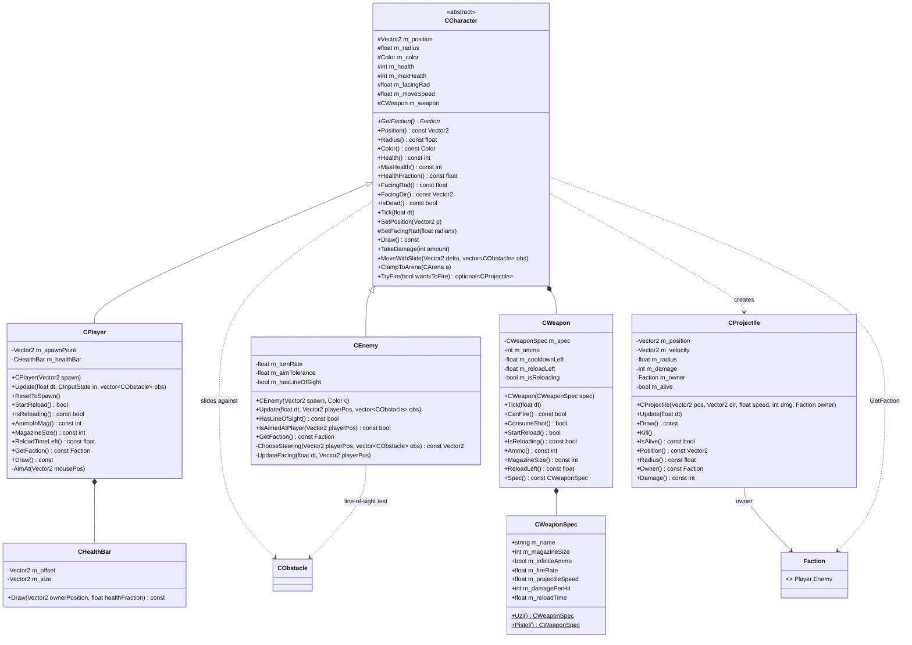

# Creative 2D Shooter — Object-Oriented Design

Status: **draft for review**. This is the follow-up design pass promised by
`GAME_DESIGN.md` (see its intro: "object-oriented structure... a separate
design pass to be done afterward"). It defines every class, its data members,
its member functions, and how the classes relate to each other, so that a
second pass can turn this directly into header/source skeletons under
`homework/src/`.

This document assumes `GAME_DESIGN.md` as the source of truth for *behavior*.
Where a method's job isn't obvious from its name, it links back to the
relevant section of that spec (e.g. "§5 step 9").

---

## 0. Naming conventions

- **Every class or struct name is prefixed with `C`**, with one exception:
  `Game` itself, which keeps the bare name already established by the
  starter code (`Game.hpp`/`Game.cpp`, referenced from `main.cpp`).
- **Enums are excluded from the `C` prefix** — `GameState` and `Faction`
  keep plain names, not `CGameState`/`CFaction`.
- **Every data member is prefixed with `m_`**, regardless of access level.
- Static-only "utility" classes (`CCollision`, `CObstacleGenerator`,
  `CSpawnLayout`) still get the `C` prefix even though they hold no state and
  are never instantiated — they're namespaces-as-classes, kept as classes for
  consistency rather than switching to free functions in a `namespace`.

---

## 1. Suggested file layout

One header (+ source) pair per class, under `homework/src/`, mirroring the
class name:

```
homework/src/
  Game.hpp / Game.cpp             (existing, extended)
  GameState.hpp                   (enum only, header-only)
  Faction.hpp                     (enum only, header-only)
  CInputState.hpp / .cpp
  CWorld.hpp / .cpp
  CArena.hpp / .cpp
  CObstacle.hpp / .cpp
  CObstacleGenerator.hpp / .cpp
  CSpawnLayout.hpp / .cpp
  CCollision.hpp / .cpp
  CEffect.hpp / .cpp
  CCharacter.hpp / .cpp
  CPlayer.hpp / .cpp
  CEnemy.hpp / .cpp
  CWeapon.hpp / .cpp
  CWeaponSpec.hpp / .cpp
  CProjectile.hpp / .cpp
  CHealthBar.hpp / .cpp
  CHud.hpp / .cpp
  COverlayScreen.hpp / .cpp
  CButton.hpp / .cpp
  Config.hpp                     (all §7 constants, header-only)
```

`Config.hpp` isn't a class — it's a header of `constexpr` values, so no class
hardcodes a magic number. Most come straight from §7 of `GAME_DESIGN.md`
(screen size, arena margin, radii, speeds, weapon stats, enemy/obstacle
counts). A few are this document's own additions, not in §7, since they're
implementation details the behavioral spec never needed to pin down — e.g.
`HealthBarOffset`/`HealthBarSize` (§9) and hit/death effect durations (§6).

---

## 2. Enums

### GameState
`MainMenu`, `Playing`, `Paused`, `GameOver`, `Win` — owned by `Game`, per §1.

### Faction
`Player`, `Enemy` — tags who owns a `CProjectile` and what a `CCharacter` is,
so friendly-fire rules (§3.3) can be expressed as plain comparisons instead
of `dynamic_cast`/RTTI.

---

## 3. Input

### CInputState
A plain per-frame snapshot, sampled once (§5 step 1) and passed down by
value/const-ref to everything that needs it, so nothing reads raylib input
functions directly except this one class.

**Members**

| Member | Type | Notes |
|---|---|---|
| `m_moveDir` | `Vector2` | Normalized WSAD direction; zero vector if nothing held |
| `m_mousePos` | `Vector2` | Current cursor position |
| `m_fireHeld` | `bool` | LMB or Space held |
| `m_reloadPressed` | `bool` | R pressed this frame |
| `m_pausePressed` | `bool` | P pressed this frame |
| `m_escPressed` | `bool` | Esc pressed this frame |
| `m_clickPressed` | `bool` | LMB pressed this frame (for menu buttons — distinct from `m_fireHeld`, which is a hold) |

**Methods**

| Signature | Notes |
|---|---|
| `static CInputState Sample()` | Reads raylib's input state for the current frame |

---

## 4. `Game`

Owns the five-state machine (§1) and nothing else about gameplay — it holds
a `CWorld` and delegates all Playing-state simulation to it. Keeps the
existing `Init`/`Shutdown`/`Update`/`Draw` signatures from the starter
`Game.hpp` and adds `ShouldQuit()`, per the spec's implementation note in §1.

**On construction:** `Game` declares no constructor of its own — every
member either has a trivial default (`m_world`, `m_hud`, see §5/§9) or a
default member initializer giving it real, final values right away (below).
The four `COverlayScreen`s can be initialized for real at this point, not
just a placeholder, because their title/color/`hasButton` never depend on
anything only known at `Init()` time (screen size, etc.) — they're
compile-time constants. This is also *why* a constructor was needed here at
all: `COverlayScreen` has no default constructor (only the 3-arg one), so
without these initializers `Game` wouldn't be default-constructible, and
`main.cpp`'s `Game game;` wouldn't compile.

**Members**

| Member | Type | Notes |
|---|---|---|
| `m_state` | `GameState` | `= GameState::MainMenu` |
| `m_score` | `int` | `= 0`. Lives here, not in `CWorld` — see "Score lifetime" in §1 |
| `m_quitRequested` | `bool` | `= false`. Set from MainMenu on Esc; polled by `main()` alongside `WindowShouldClose()` |
| `m_world` | `CWorld` | All Playing-state simulation. Default-constructed here (see §5's own construction note); real setup happens in `Init()` |
| `m_hud` | `CHud` | Bottom-left/right + top-right overlay. No members (§9), default-constructed trivially |
| `m_mainMenuScreen` | `COverlayScreen` | `= COverlayScreen{"", DARKGRAY, true}` — title left blank; `GAME_DESIGN.md` §1 only says "centered title text" without pinning down the actual string, flagged as open item 10 in §13 |
| `m_pausedScreen` | `COverlayScreen` | `= COverlayScreen{"PAUSED", RAYWHITE, false}` |
| `m_gameOverScreen` | `COverlayScreen` | `= COverlayScreen{"GAME OVER", RED, true}` |
| `m_winScreen` | `COverlayScreen` | `= COverlayScreen{"YOU WON", GREEN, true}` |

**Methods**

| Signature | Notes |
|---|---|
| `void Init(int screenWidth, int screenHeight, int targetFps)` | Existing signature. No longer needs to build the `COverlayScreen`s (done above) — calls `m_world.Init(screenWidth, screenHeight)`, `SetExitKey(KEY_NULL)` (§1's implementation note) |
| `void Shutdown()` | Existing signature |
| `void Update(float deltaTime)` | Existing signature. See flow below |
| `void Draw(int screenWidth, int screenHeight) const` | Existing signature. Always draws `m_world` + `m_hud` as backdrop, then overlays the active screen on top for Paused/GameOver/Win/MainMenu |
| `bool ShouldQuit() const` | New — `main()`'s loop condition becomes `!WindowShouldClose() && !game.ShouldQuit()` |
| `private: bool HandleGlobalInput(const CInputState& input)` | Esc/P handling, state-dependent per §1 and §5 step 2. Returns `true` if it consumed the frame (a transition happened), telling `Update` to skip the state-specific branch below |
| `private: void UpdatePlaying(float dt, const CInputState& input)` | The `Playing`-state branch of `Update`: runs `m_world.Update(dt, input)`, folds `m_world.ConsumeKills()` into `m_score`, then checks `m_world.PlayerIsDead()`/`m_world.AllEnemiesDead()` and calls `SetState` accordingly. Pulled into its own method because it's the only one of the five state branches with more than one statement — MainMenu/GameOver/Win are each a single `if`, and Paused does nothing |
| `private: void StartNewGame()` | Tears down/rebuilds `CWorld` (`m_world.Reset()`), sets state to `Playing`. Does **not** touch score — callers decide that (see next two) |
| `private: void ReturnToMenu()` | Sets state to `MainMenu`, calls `ResetScore()` |
| `private: void ResetScore()` | `m_score = 0`. Called by `ReturnToMenu()` and by the GameOver→Start/Esc transition, per "Score lifetime" in §1 |
| `private: void SetState(GameState s)` | Trivial setter, kept as a single choke point in case transitions ever need side effects (e.g. logging) |

**`Update` flow, in words:**
1. `input = CInputState::Sample()`.
2. `if (HandleGlobalInput(input)) return;` — Esc/P short-circuit the frame.
3. `switch (m_state)`:
   - `MainMenu`: `if (m_mainMenuScreen.Update(input.m_mousePos, input.m_clickPressed)) StartNewGame();`
   - `Playing`: `UpdatePlaying(deltaTime, input);` (mirrors §5 step 12 internally).
   - `Paused`: nothing — frame is frozen.
   - `GameOver`: `if (m_gameOverScreen.Update(...)) { ResetScore(); StartNewGame(); }`
   - `Win`: `if (m_winScreen.Update(...)) StartNewGame();` — score carries over, per §1.

---

## 5. `CWorld` — the Playing-state simulation

Everything that exists only while playing lives here: arena, player, enemies,
obstacles, projectiles, effects. `CWorld::Update` implements the 12-step
per-frame order from `GAME_DESIGN.md` §5 almost one-for-one via its private
methods, so the order is self-documenting in code, not just in the spec doc.

**On construction:** unlike `Game`'s `COverlayScreen`s, `m_arena` and
`m_player` genuinely can't be given their real values as default member
initializers — those depend on `screenWidth`/`screenHeight`, which aren't
known until `Init()` runs (and `CWorld` is default-constructed before that,
as a member of `Game`). So they get harmless placeholder default member
initializers instead — using `CArena`/`CPlayer`'s existing constructors
with dummy arguments, not new default constructors on those classes — and
`Init()`/`Reset()` overwrite them for real via plain assignment before
`Playing` state is ever reached. `CArena` and `CPlayer` need nothing added
to their own interfaces for this to work; they just need to stay copy/move
assignable, which they already are.

**Members**

| Member | Type | Notes |
|---|---|---|
| `m_arena` | `CArena` | `= CArena{0, 0, 0.0f}` (placeholder); real bounds assigned by `Init()` |
| `m_player` | `CPlayer` | `= CPlayer{Vector2{0, 0}}` (placeholder); `Init()` assigns a real `CPlayer` once real spawn point is knowable (see below) — necessary because `CPlayer::ResetToSpawn()` reuses a spawn point *cached at construction time*, so `Reset()` alone could never correct a placeholder's `(0,0)` |
| `m_enemies` | `std::vector<CEnemy>` | Fixed count at spawn (§7), shrinks as they die |
| `m_obstacles` | `std::vector<CObstacle>` | Fixed count, regenerated each `Reset()` |
| `m_projectiles` | `std::vector<CProjectile>` | Grows/shrinks continuously |
| `m_effects` | `std::vector<CEffect>` | Hit/death flash placeholders (§9 "confirmed") |
| `m_rng` | `std::mt19937` | Default-constructed (fixed default seed, never observed); seeded for real once in `Init()`, then reused (not reseeded) across `Reset()` calls, since obstacle *positions* must re-randomize each game while enemy *spawn positions* stay deterministic (§1 "What a new game resets") |
| `m_pendingKills` | `int` | `= 0` |

**Methods**

| Signature | Notes |
|---|---|
| `void Init(int screenWidth, int screenHeight)` | Assigns real values over the two placeholders: `m_arena = CArena(screenWidth, screenHeight, Config::ArenaMargin)`, then (now that `m_arena`'s real bounds exist) `m_player = CPlayer(CSpawnLayout::PlayerSpawn(m_arena))`. Also seeds `m_rng`. Called once from `Game::Init`, before any `Reset()` — mirrors `Game`'s own `Init`/`Shutdown` style (not a parameterized constructor) so construction order stays explicit rather than implicit in static/global init |
| `void Reset()` | Resets the player via `m_player.ResetToSpawn()` (cheap — reuses the real spawn point `Init()` already cached), rebuilds enemies (fixed deterministic positions, re-randomized colors), obstacles (re-rolled via `CObstacleGenerator`), clears projectiles and effects, `m_pendingKills = 0`. Implements "What a new game resets" in §1 |
| `void Update(float dt, const CInputState& input)` | Runs the private steps below in order |
| `void Draw() const` | Arena outline, obstacles, enemies, player, projectiles, effects, in back-to-front order |
| `bool PlayerIsDead() const` | `m_player.IsDead()` |
| `bool AllEnemiesDead() const` | `m_enemies.empty()` |
| `int EnemiesLeft() const` | `m_enemies.size()`, for the HUD |
| `int ConsumeKills()` | Returns `m_pendingKills` and resets it to 0 |
| `const CPlayer& GetPlayer() const` | Read access for `CHud` |
| `private: void TickTimers(float dt)` | §5 step 3 — calls `Tick(dt)` on the player and on every enemy; each one forwards internally to its own `m_weapon.Tick(dt)` |
| `private: void UpdateSteeringAndInput(float dt, const CInputState& input)` | §5 step 4 — player desired displacement from WSAD; each enemy's from line-of-sight (direct-approach or corner-seek) |
| `private: void ResolveObstacleSliding()` | §5 step 5 — axis-separated slide, per entity, via `CCharacter::MoveWithSlide` |
| `private: void ClampToArenaBounds()` | §5 step 6 |
| `private: void ResolvePushApart()` | §5 step 7 — for every player/enemy circle pair, reads both positions, calls `CCollision::ResolveCircleOverlap` on them, writes the results back via `SetPosition`, then re-clamps to the arena |
| `private: void UpdateFacing(float dt)` | §5 step 8 — player snaps to mouse; each enemy turns at most `180°/s × dt` |
| `private: void ResolveFiring(const CInputState& input)` | §5 step 9 — player fires when `input.m_fireHeld` and its weapon allows it; each enemy fires when LOS + facing-tolerance + cooldown all pass. Appends to `m_projectiles`. Needs `input` directly — it isn't cached anywhere between step 4 and step 9 |
| `private: void UpdateProjectiles(float dt)` | §5 step 10 |
| `private: void ResolveProjectileCollisions()` | §5 step 11 — projectile vs. obstacle/arena/circles, damage with health clamped to ≥0; pushes `CEffect::Hit(...)` on any hit and `CEffect::Death(...)` if the target's health reached 0, then defers removal to `ReapDeadEnemies` |
| `private: void ReapDeadEnemies()` | Removes dead enemies from `m_enemies`, increments `m_pendingKills` once per removed enemy regardless of who shot it (§6 score rule) |
| `private: void RemoveExpiredProjectiles()` | Sweeps projectiles with `IsAlive() == false` |
| `private: void RemoveExpiredEffects()` | Sweeps effects with `IsExpired() == true` |

---

## 6. Arena, obstacles & effects

### CArena

**Members**

| Member | Type | Notes |
|---|---|---|
| `m_bounds` | `Rectangle` | `x=M, y=M, width=screenW-2M, height=screenH-2M` |
| `m_margin` | `float` | `M`, kept alongside bounds for convenience (drawing the border, etc.) |

**Methods**

| Signature | Notes |
|---|---|
| `CArena(int screenWidth, int screenHeight, float margin)` | Computes `m_bounds = {margin, margin, screenWidth - 2*margin, screenHeight - 2*margin}`; stores `margin` in `m_margin`. Constructed by `CWorld::Init` |
| `Rectangle Bounds() const` | |
| `Vector2 ClampCircle(Vector2 pos, float radius) const` | Center clamped to `[M+r, size-M-r]` on each axis, per §2 |
| `bool Contains(Vector2 point) const` | Point-in-bounds test, used by the two methods below |
| `bool CircleExitsBounds(Vector2 pos, float radius) const` | True once the circle's edge would cross the boundary — the projectile-destruction condition in §3.3 |
| `void Draw() const` | Thin border outline |

### CObstacle

**Members**

| Member | Type | Notes |
|---|---|---|
| `m_rect` | `Rectangle` | Axis-aligned, no rotation (§3.4, §9 confirmed) |

**Methods**

| Signature | Notes |
|---|---|
| `explicit CObstacle(Rectangle rect)` | Constructed by `CObstacleGenerator::Generate` |
| `Rectangle Rect() const` | Plain accessor — needed by `CCollision`, `CEnemy` steering, drawing, everything external |
| `bool BlocksCircle(Vector2 center, float radius) const` | Circle-vs-AABB test, used both for character movement (§5) and projectile collision (§3.3). Delegates to `CCollision::CircleVsRect` |
| `bool BlocksSegment(Vector2 a, Vector2 b) const` | Segment-vs-AABB, for the enemy line-of-sight test (§3.2). Delegates to `CCollision::SegmentVsRect` |
| `Vector2 NearestPoint(Vector2 from) const` | Closest point on/in the rectangle to an arbitrary point — used by the **150px spawn clearance** rule (rejection rule 1, §3.4), which explicitly measures to the nearest point, not a corner. Delegates to `CCollision::NearestPointOnRect` |
| `Vector2 NearestCorner(Vector2 from) const` | Nearest of the four corner **vertices** — used by `CEnemy`'s corner-seek steering target (§3.2), which is a different geometric query from the one above. Delegates to `CCollision::NearestCornerOfRect` |
| `float DistanceTo(Vector2 point) const` | `length(point - NearestPoint(point))` |
| `float GapTo(const CObstacle& other) const` | Rejection rule 2's gap formula (§3.4). Delegates to `CCollision::RectGap` |
| `float HalfThickness() const` | `min(width, height) / 2`, per rejection rule 2 |
| `void Draw() const` | Filled rect + lighter outline |

### CObstacleGenerator (static utility)

| Signature | Notes |
|---|---|
| `static std::vector<CObstacle> Generate(int count, const CArena& arena, const std::vector<Vector2>& clearancePoints, std::mt19937& rng)` | Rejection-sampling loop per §3.4, capped at ~200 attempts per obstacle; skips an obstacle that can't find a valid spot. `clearancePoints` is the player spawn + all enemy spawns |

### CSpawnLayout (static utility)

| Signature | Notes |
|---|---|
| `static Vector2 PlayerSpawn(const CArena& arena)` | Bottom-middle, pre-clamped per §3.1's note on avoiding the first-frame snap |
| `static std::vector<Vector2> EnemySpawns(const CArena& arena, int count)` | The midpoint-of-each-stretch formula along the top edge + upper halves of the sides, §3.2 |
| `static Color RandomEnemyColor(std::mt19937& rng)` | Hue rejection-sampled outside `[177°, 237°]`, fixed saturation/brightness, §3.2 |

### CEffect

The minimal hit/death placeholder confirmed in `GAME_DESIGN.md` §9 ("brief
flash/scale-down"). This subsection was missing its own write-up in the
first draft — it only appeared inside the class diagram — so it's added
here now. Constructed via two named factories rather than a public
constructor plus a `bool` flag, mirroring the `CWeaponSpec::Uzi()`/
`Pistol()` pattern already used elsewhere in this doc.

**Members**

| Member | Type | Notes |
|---|---|---|
| `m_position` | `Vector2` | |
| `m_radius` | `float` | Used by `Death` to size the shrink animation to the dying character's radius; unused (0) for `Hit` |
| `m_color` | `Color` | |
| `m_age` | `float` | Seconds since spawn |
| `m_duration` | `float` | Total lifetime before `IsExpired()` |
| `m_isDeath` | `bool` | Selects flash-vs-scale-down rendering in `Draw()` |

**Methods**

| Signature | Notes |
|---|---|
| `static CEffect Hit(Vector2 position, Color color)` | Brief flash at a non-lethal hit location |
| `static CEffect Death(Vector2 position, float radius, Color color)` | Scale-down placeholder, sized to the character that just died |
| `void Update(float dt)` | Advances `m_age` |
| `bool IsExpired() const` | `m_age >= m_duration` |
| `void Draw() const` | Flash (`Hit`) or shrinking circle (`Death`), based on `m_isDeath` |
| `private: CEffect(Vector2 position, float radius, Color color, float duration, bool isDeath)` | Shared constructor behind the two factories above |

---

## 7. Characters & weapons

### CCharacter (abstract base)

Shared by `CPlayer` and `CEnemy`: everything about being a circle with
health, a facing direction, and a weapon. Neither movement input handling
nor AI decision-making lives here — those are genuinely different between
the two subclasses and belong in them.

**Members** (all `protected`)

| Member | Type | Notes |
|---|---|---|
| `m_position` | `Vector2` | |
| `m_radius` | `float` | 32px for both player and enemy (§3.1, §3.2) |
| `m_color` | `Color` | Player's fixed blue, or an enemy's randomized color |
| `m_health` | `int` | Clamped to `[0, m_maxHealth]` on every change, never negative (§3.1) |
| `m_maxHealth` | `int` | 6 for both (§7) |
| `m_facingRad` | `float` | Radians; player snaps to mouse, enemy turns at a limited rate |
| `m_moveSpeed` | `float` | 260 px/s for both (§7) |
| `m_weapon` | `CWeapon` | Uzi for player, Pistol for enemy — distinct definitions, not a shared one (§4) |

**Methods**

| Signature | Notes |
|---|---|
| `virtual Faction GetFaction() const = 0` | Lets `CProjectile`/friendly-fire logic branch without RTTI |
| `Vector2 Position() const` | |
| `float Radius() const` | |
| `Color Color() const` | |
| `int Health() const` | |
| `int MaxHealth() const` | |
| `float HealthFraction() const` | `Health() / (float)MaxHealth()`, always in `[0,1]` since health is pre-clamped — feeds `CHealthBar` and could feed future HUD/UI needs |
| `float FacingRad() const` | |
| `Vector2 FacingDir() const` | Unit vector from `m_facingRad` |
| `bool IsDead() const` | `m_health <= 0` |
| `void Tick(float dt)` | Forwards to `m_weapon.Tick(dt)` (§5 step 3). Called externally by `CWorld::TickTimers` on the player and each enemy, so `CWorld` never has to reach into a character's weapon directly |
| `void SetPosition(Vector2 p)` | Public mutator — needed by `CWorld::ResolvePushApart` (which reads/writes positions around the decoupled `CCollision::ResolveCircleOverlap`) and `CPlayer::ResetToSpawn` |
| `protected: void SetFacingRad(float radians)` | Normalizes the angle and stores it in `m_facingRad`. Shared by `CPlayer::AimAt` and `CEnemy::UpdateFacing` so the angle-wrapping math (needed for "shorter path, no overshoot") is written once, not duplicated in both subclasses |
| `void Draw() const` | Body + gun rectangle toward facing + two eye dots, per §3.1/§3.2. `CPlayer` and `CEnemy` override to add/omit the health bar |
| `void TakeDamage(int amount)` | Subtracts, clamps `m_health` to `[0, m_maxHealth]` immediately (§5 step 11) |
| `void MoveWithSlide(Vector2 delta, const std::vector<CObstacle>& obstacles)` | Axis-separated slide from §5 ("How movement interacts with obstacles") |
| `void ClampToArena(const CArena& arena)` | `m_position = arena.ClampCircle(m_position, m_radius)` |
| `std::optional<CProjectile> TryFire(bool wantsToFire)` | `wantsToFire` is the caller-specific gate (player: button held; enemy: LOS + facing tolerance, computed by the subclass). Internally: if `wantsToFire && m_weapon.CanFire()`, consume the shot and spawn a projectile at `m_position + FacingDir() * m_radius`, else return empty |
| `protected: CCharacter(Vector2 position, float radius, Color color, int maxHealth, float moveSpeed, CWeapon weapon)` | Shared constructor for subclasses |

### CPlayer : CCharacter

**Members**

| Member | Type | Notes |
|---|---|---|
| `m_spawnPoint` | `Vector2` | Cached from `CSpawnLayout::PlayerSpawn`, reused by `ResetToSpawn` |
| `m_healthBar` | `CHealthBar` | Owned here — enemies never get one (§3.2) |

**Methods**

| Signature | Notes |
|---|---|
| `CPlayer(Vector2 spawn)` | Constructs base with Uzi spec, blue color, spawn position |
| `void Update(float dt, const CInputState& input, const std::vector<CObstacle>& obstacles)` | R → `StartReload()`; WSAD → movement intent (handled by `CWorld` calling `MoveWithSlide`); mouse → `AimAt(input.m_mousePos)` |
| `void ResetToSpawn()` | `SetPosition(m_spawnPoint)`, `m_health = m_maxHealth`, rebuilds `m_weapon` fresh (full mag, reload cancelled). Takes no parameters — the player's spawn point is a fixed, deterministic formula (not randomized, §3.1), so it's computed once via `CSpawnLayout::PlayerSpawn` and cached in `m_spawnPoint` at construction rather than recomputed on every reset |
| `bool StartReload()` | Delegates to `m_weapon.StartReload()`; no-op if already reloading (§3.1) |
| `bool IsReloading() const` | Delegates |
| `int AmmoInMag() const` | Delegates |
| `int MagazineSize() const` | Delegates — HUD's `Ammo: {current}/{magazineSize}` |
| `float ReloadTimeLeft() const` | Delegates — HUD's `Reloading {remaining:.1f}s` |
| `Faction GetFaction() const override` | Returns `Player` |
| `void Draw() const override` | Base `Draw()` + `m_healthBar.Draw(Position() + offset, HealthFraction())` |
| `private: void AimAt(Vector2 mousePos)` | Instant facing snap toward the cursor, no turn-rate limit (unlike `CEnemy`) — computes the angle and stores it via the base's `SetFacingRad` |

### CEnemy : CCharacter

**Members**

| Member | Type | Notes |
|---|---|---|
| `m_turnRate` | `float` | 180°/s (§7) |
| `m_aimTolerance` | `float` | 5° (§7) |
| `m_hasLineOfSight` | `bool` | Computed once per frame in `Update`, cached so the firing gate can reuse it instead of re-testing (§3.2, §5 step 9) |

**Methods**

| Signature | Notes |
|---|---|
| `CEnemy(Vector2 spawn, Color color)` | Constructs base with Pistol spec; `m_facingRad` initialized to straight-down, per §3.2 |
| `void Update(float dt, Vector2 playerPos, const std::vector<CObstacle>& obstacles)` | Runs `ChooseSteering` then `UpdateFacing`; updates `m_hasLineOfSight` |
| `bool HasLineOfSight() const` | Cached result from the last `Update` |
| `bool IsAimedAtPlayer(Vector2 playerPos) const` | True if `FacingDir()` is within `m_aimTolerance` of the direction to `playerPos` — the third firing condition in §3.2's Combat paragraph |
| `Faction GetFaction() const override` | Returns `Enemy` |
| `private: Vector2 ChooseSteering(Vector2 playerPos, const std::vector<CObstacle>& obstacles) const` | Direct-approach if LOS is clear; else nearest-corner-of-blocking-obstacle, per §3.2 |
| `private: void UpdateFacing(float dt, Vector2 playerPos)` | Rotates toward the player by at most `m_turnRate × dt`, shorter angular path, no overshoot — stores the result via the base's `SetFacingRad` |

### CWeapon

The live, per-owner instance: ammo, cooldown, reload state. Deliberately
separate from `CWeaponSpec` (the immutable numbers) so a future "weapon
pickup" just swaps which `CWeaponSpec` a `CWeapon` wraps, per §4's note that
this is left open for a later pass.

**Members**

| Member | Type | Notes |
|---|---|---|
| `m_spec` | `CWeaponSpec` | Immutable stats |
| `m_ammo` | `int` | Ignored/unused when `m_spec.m_infiniteAmmo` is true |
| `m_cooldownLeft` | `float` | Seconds until next allowed shot |
| `m_reloadLeft` | `float` | Seconds left on an in-progress reload |
| `m_isReloading` | `bool` | |

**Methods**

| Signature | Notes |
|---|---|
| `explicit CWeapon(CWeaponSpec spec)` | `m_ammo = spec.m_magazineSize` (meaningless but harmless if infinite) |
| `void Tick(float dt)` | Decrements `m_cooldownLeft`; if reloading, decrements `m_reloadLeft` and refills + clears the flag at zero (§5 step 3) |
| `bool CanFire() const` | `!m_isReloading && m_cooldownLeft <= 0 && (m_spec.m_infiniteAmmo \|\| m_ammo >= 1)` |
| `bool ConsumeShot()` | Only valid to call when `CanFire()` — decrements ammo (if finite), resets `m_cooldownLeft = 1 / m_spec.m_fireRate` |
| `bool StartReload()` | No-op (`false`) if infinite ammo or already reloading; else starts the timer (§3.1) |
| `bool IsReloading() const` | |
| `int Ammo() const` | |
| `int MagazineSize() const` | Delegates to spec — the accessor I'd originally missed |
| `float ReloadLeft() const` | |
| `const CWeaponSpec& Spec() const` | |

### CWeaponSpec (struct)

**Members**

| Member | Type | Notes |
|---|---|---|
| `m_name` | `std::string` | Cosmetic/debug |
| `m_magazineSize` | `int` | |
| `m_infiniteAmmo` | `bool` | True for Pistol |
| `m_fireRate` | `float` | Rounds/second |
| `m_projectileSpeed` | `float` | Shared value (900) but authored per-weapon per §4 |
| `m_damagePerHit` | `int` | |
| `m_reloadTime` | `float` | Unused when `m_infiniteAmmo` |

**Methods**

| Signature | Notes |
|---|---|
| `static CWeaponSpec Uzi()` | 50 / 8 / 900 / 1 / 3.0s, finite ammo |
| `static CWeaponSpec Pistol()` | infinite / 4 / 900 / 1 / n/a |

---

## 8. Projectile

### CProjectile

**Members**

| Member | Type | Notes |
|---|---|---|
| `m_position` | `Vector2` | |
| `m_velocity` | `Vector2` | `direction * speed` |
| `m_radius` | `float` | 5px (§7) |
| `m_damage` | `int` | Copied from the firing weapon's spec at spawn time |
| `m_owner` | `Faction` | Drives friendly-fire rules in `CWorld::ResolveProjectileCollisions` |
| `m_alive` | `bool` | |

**Methods**

| Signature | Notes |
|---|---|
| `CProjectile(Vector2 position, Vector2 direction, float speed, int damage, Faction owner)` | |
| `void Update(float dt)` | `m_position += m_velocity * dt` |
| `void Draw() const` | Fixed color per faction |
| `void Kill()` | `m_alive = false` |
| `bool IsAlive() const` | |
| `Vector2 Position() const` | Missing in the first pass — required for every collision check against it |
| `float Radius() const` | Same reason |
| `Faction Owner() const` | |
| `int Damage() const` | |

---

## 9. UI

### CHealthBar

New class (previously missing). A small, reusable, stateless-ish rendering
component — deliberately not folded into `CCharacter`, since only the player
ever gets one and the drawing logic (fixed offset, axis-aligned fill
regardless of facing) is pure presentation with no gameplay data of its own
beyond what it's handed.

**Members**

| Member | Type | Notes |
|---|---|---|
| `m_offset` | `Vector2` | `= Config::HealthBarOffset` — fixed offset above the owner's position (§3.1). Given as a default member initializer, not a constructor parameter, since it never varies per-instance (only `CPlayer` ever has one) — same reasoning as `Game`'s `COverlayScreen`s |
| `m_size` | `Vector2` | `= Config::HealthBarSize` — same reasoning |

**Methods**

| Signature | Notes |
|---|---|
| `void Draw(Vector2 ownerPosition, float healthFraction) const` | Background rect + fill rect scaled by `healthFraction`, always axis-aligned |

### CHud

Genuinely has no data members. Every line it draws is derived entirely from
what's passed into `Draw` (`player`, `score`, `enemiesLeft`) plus raylib's
own per-frame state (`GetFPS()`, the fixed 1920×1080 layout). It's shaped
the same way as the static-utility classes in §10 — nothing persists between
frames — but it stays an instantiated member of `Game` (`m_hud`) rather than
another `<<utility>>` class, since conceptually there's exactly one HUD, not
a bag of stateless helper functions.

**Methods**

| Signature | Notes |
|---|---|
| `void Draw(const CPlayer& player, int score, int enemiesLeft) const` | Orchestrates the three regions below |
| `private: void DrawStats(const CPlayer& player, int score, int enemiesLeft) const` | Bottom-right stack (§6): reload line (reserves its slot even when blank), score, enemies left, ammo, health |
| `private: void DrawControlsLegend() const` | Bottom-left single line |
| `private: void DrawFps() const` | Top-right, matches starter overlay style |

### COverlayScreen

Shared by MainMenu/Paused/GameOver/Win — GameOver and Win are "the same
reusable concept" per §1, differing only in title text/color and whether a
button is present (Paused has none).

**Members**

| Member | Type | Notes |
|---|---|---|
| `m_title` | `std::string` | e.g. `"GAME OVER"`, `"YOU WON"`, `"PAUSED"` |
| `m_titleColor` | `Color` | Red / green / neutral |
| `m_hasButton` | `bool` | False for Paused |
| `m_startButton` | `CButton` | Unused if `!m_hasButton` |

**Methods**

| Signature | Notes |
|---|---|
| `COverlayScreen(std::string title, Color titleColor, bool hasButton)` | No label parameter — every button this game ever shows is labeled "Start" (`GAME_DESIGN.md` §1, all three screens), so the label is hardcoded internally when `hasButton` is true rather than threaded through as a parameter that would never vary. Worth revisiting only if a future screen needs different button text |
| `bool Update(Vector2 mousePos, bool clicked)` | Returns true iff the button exists, is hovered, and was clicked this frame |
| `void Draw(int screenWidth, int screenHeight) const` | Centered title (+ button if present) over whatever `Game::Draw` already rendered as backdrop |

### CButton

**Members**

| Member | Type | Notes |
|---|---|---|
| `m_rect` | `Rectangle` | |
| `m_label` | `std::string` | e.g. `"Start"` |

**Methods**

| Signature | Notes |
|---|---|
| `CButton(Rectangle rect, std::string label)` | |
| `bool IsHovered(Vector2 mousePos) const` | |
| `bool WasClicked(Vector2 mousePos, bool clicked) const` | `IsHovered(mousePos) && clicked` |
| `void Draw() const` | |

---

## 10. Static utilities recap

`CCollision`, `CObstacleGenerator`, and `CSpawnLayout` (defined inline in
their sections above) hold no state and are never instantiated — every
member is `static`. This keeps pure geometry/generation math out of the
entity classes rather than, say, giving `CObstacle` a static factory method
or duplicating segment/circle tests inside both `CCharacter` and `CWorld`.

### CCollision (static utility) — full method list

| Signature | Notes |
|---|---|
| `static bool CircleVsRect(Vector2 center, float radius, Rectangle rect)` | |
| `static bool SegmentVsRect(Vector2 a, Vector2 b, Rectangle rect)` | |
| `static bool CircleVsCircle(Vector2 a, float ra, Vector2 b, float rb)` | |
| `static Vector2 NearestPointOnRect(Vector2 point, Rectangle rect)` | Closest point on/in the rectangle to an arbitrary point. `CObstacle::NearestPoint`/`DistanceTo` delegate here |
| `static Vector2 NearestCornerOfRect(Vector2 point, Rectangle rect)` | Nearest of the rectangle's four corner vertices. `CObstacle::NearestCorner` delegates here |
| `static float RectGap(Rectangle a, Rectangle b)` | Combined horizontal/vertical gap between two rectangles: `sqrt(hGap² + vGap²)`. `CObstacle::GapTo` delegates here |
| `static void ResolveCircleOverlap(Vector2& posA, float radiusA, Vector2& posB, float radiusB)` | Splits any overlap between the two circles evenly along the line between their centers (§5 "push-apart"). Takes raw position/radius by reference rather than `CCharacter&`, so `CCollision` has no dependency on the character hierarchy at all — `CWorld::ResolvePushApart` is what bridges the two, reading `Position()`/`Radius()` in and calling `SetPosition()` back out |

---

## 11. Class relationships





---

## 12. `CWorld::Update` ↔ `GAME_DESIGN.md` §5 cross-reference

| §5 step | `CWorld` private method |
|---|---|
| 1. Input sampling | (done by `Game`, passed in as `input`) |
| 2. Global state transitions | (done by `Game::HandleGlobalInput`, before `CWorld::Update` is even called) |
| 3. Timers tick down | `TickTimers` |
| 4. Movement/steering intent | `UpdateSteeringAndInput` |
| 5. Axis-separated slide | `ResolveObstacleSliding` |
| 6. Arena-bounds clamp | `ClampToArenaBounds` |
| 7. Circle-vs-circle push-apart (+ re-clamp) | `ResolvePushApart` |
| 8. Facing update | `UpdateFacing` |
| 9. Firing | `ResolveFiring` |
| 10. Projectile movement | `UpdateProjectiles` |
| 11. Projectile collisions | `ResolveProjectileCollisions` (calls `ReapDeadEnemies`, `SpawnEffect`) |
| 12. Win/loss check | (done by `Game`, using `PlayerIsDead()`/`AllEnemiesDead()` after `CWorld::Update` returns) |

`RemoveExpiredProjectiles`/`RemoveExpiredEffects` aren't numbered steps in
§5 — they're bookkeeping, run at the end of `Update` to sweep anything
`Kill()`ed or expired during this frame's steps 10–11.

---

## 13. Open items for your review

Carried over/expanded from the class-diagram discussion — flag anything you
want changed before this goes to an implementation pass:

1. **Prefixing settled**: classes/structs get `C` (except `Game`); enums
   (`GameState`, `Faction`) are excluded and keep plain names.
2. **`CWorld` split from `Game`** — kept from the original diagram: `Game`
   is state-machine-only, `CWorld` is Playing-state simulation-only. Costs
   one extra class; avoids a god-object `Game`.
3. **Static-utility framing** for `CCollision`, `CObstacleGenerator`,
   `CSpawnLayout` — stateless classes with only `static` methods, rather
   than free functions in a namespace or methods folded into `CWorld`/
   `CObstacle`.
4. **`CEffect`** is my addition for the hit/death flash placeholder that
   `GAME_DESIGN.md` §9 already confirmed as in-scope ("minimal
   placeholder... brief flash/scale-down").
5. **`CHealthBar`** is a standalone class owned only by `CPlayer`, not a
   method on `CCharacter` — since enemies never get one (§3.2) and it's
   pure rendering with its own small bit of layout state (offset, size).
6. **`TryFire(bool wantsToFire)`** takes the fire-gate as a parameter rather
   than `CCharacter` knowing how to compute it — player's gate is "button
   held", enemy's is "LOS + facing tolerance", and those genuinely belong
   in the subclasses, not the base.
7. **`Config.hpp`** for all of §7's constants isn't a class at all, just a
   header of `constexpr` values — flagged here since everything else in
   this doc is a class.
8. **`CWorld::Init(screenWidth, screenHeight)`** mirrors `Game`'s existing
   `Init`/`Shutdown` style rather than being a parameterized constructor —
   for consistency with the one class that already sets that precedent.
   `CArena` and `CObstacle`, by contrast, get ordinary parameterized
   constructors, since they're plain value types with no raylib-timing
   concerns.
9. **`COverlayScreen`'s button label is hardcoded to `"Start"` internally**
   rather than taken as a constructor parameter, since every screen that
   has a button uses that exact word (§1). Revisit if a future screen ever
   needs different button text.
10. **The MainMenu's title text isn't pinned down.** `GAME_DESIGN.md` §1
    only says "centered title text" — it never gives the actual string
    (unlike GameOver's "GAME OVER" or Win's "YOU WON", which are quoted
    directly). `m_mainMenuScreen`'s default member initializer (§4) leaves
    it as `""` as a placeholder. Needs a real value — the game's title —
    before implementation.
11. **Construction/default-member-initializer pass (this round's fix):**
    `Game`'s four `COverlayScreen`s and `CWorld`'s `m_arena`/`m_player` are
    bare value members of types with no default constructor, and neither
    `Game` nor `CWorld` declared a constructor of their own — as originally
    drafted, neither class would have compiled. `CHealthBar`'s `m_offset`/
    `m_size` had the same shape of problem, one level further down (no
    constructor, no setter, no default — `CPlayer::m_healthBar` would sit
    at an indeterminate offset/size forever). All fixed via default member
    initializers on the containing/affected classes (§4, §5, §9) rather
    than adding new default constructors to `CArena`, `CPlayer`,
    `COverlayScreen`, or `CButton` — those keep exactly the constructors
    they had. I swept every other bare (non-`std::vector`) custom-typed
    member in the doc against this same failure mode and didn't find
    another instance — everything else is either inside a `std::vector`
    (never needs default construction), or already receives a real value
    through a constructor parameter at the point it's constructed.

---

## 14. Handoff notes for the next pass

When this is handed off for header skeletons (and possibly implementation):

- Treat `GAME_DESIGN.md` as the behavioral source of truth and this file as
  the structural source of truth — if they ever conflict, that's a bug in
  this document to fix, not a license to improvise a third answer.
- The file layout in §1 and the member/method tables in §§2–9 are meant to
  be turned into headers close to verbatim — access specifiers, `const`-ness,
  and `virtual`/`override` are all specified above.
- §12's cross-reference table is there specifically so `CWorld::Update`'s
  body can be written as a sequence of calls in that exact order, matching
  §5 of `GAME_DESIGN.md` step for step.
- Don't resolve any item in §13 unilaterally — those are open questions for
  me, not implementation decisions.
