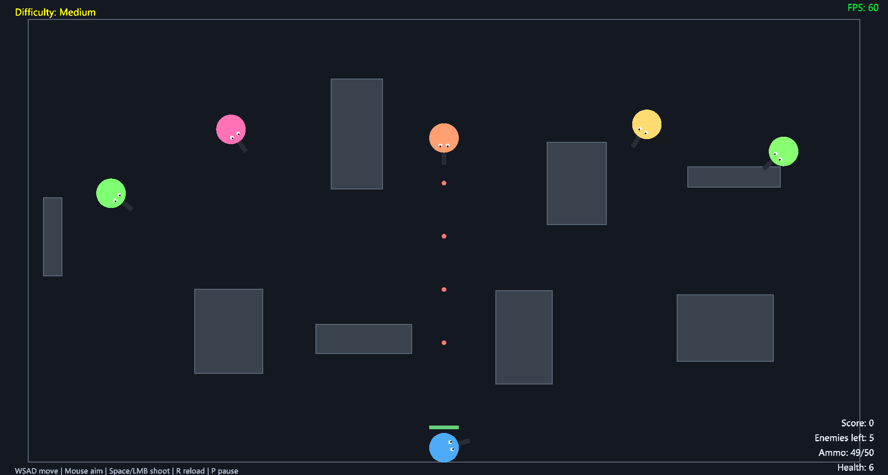

# Creative 2D Shooter Game

A top-down 2D arena shooter written in modern C++ (C++23) on top of raylib, built around a small set of focused classes (world, characters, weapons, obstacles, HUD). Enemy AI scales across four difficulty levels, and all gameplay tuning lives in a single header, `Config.hpp`.



## Game manual

### Mission

Score the highest you can by killing the enemy shooters.

### Gameplay

- `W` `A` `S` `D` keys to move
- Mouse to aim and shoot (`Space` can also be used to shoot)
- `P` to pause
- `Esc` returns to the main menu (and quits the game when pressed on the main menu)
- After 50 shots you must reload the magazine with the `R` key

### Difficulty levels

Difficulty is picked on the main menu and is locked for the duration of a game. To change it, press `Esc` to return to the menu and start a new game.

Each level adds to the previous one:

| Level     | Enemy behavior                                                                      |
|-----------|-------------------------------------------------------------------------------------|
| Easy      | Enemy weapon is a revolver                                                          |
| Medium    | Enemy weapon is upgraded to a pistol                                                |
| Hard      | Enemies also seek cover when damaged                                                |
| Very Hard | Enemies behind obstacles also go around them, giving you less time to regroup       |

## Build and run

Requirements: Windows, CMake 3.16+, and a C++23-capable compiler (Visual Studio / MSVC). raylib is bundled in `external/raylib`, so nothing else needs to be installed.

From the repository root, in PowerShell:

```powershell
# Build (Release by default) and launch the game
.\homework\build.ps1 -Run

# Or build only, choosing a configuration: Debug, Release, RelWithDebInfo or MinSizeRel
.\homework\build.ps1 -Config Debug
```

The executable is written to `homework/build/<Config>/homework-assignment.exe`.

## Design documents

See `GAME_DESIGN.md` for the game rules and `OOP_DESIGN.md` for the class structure, both in the repository root.

## Tuning the game

Refer to `homework/src/Config.hpp`, where you can easily change any of these:

| Setting                                              | Description                                       |
|------------------------------------------------------|---------------------------------------------------|
| `ScreenWidth` / `ScreenHeight`                       | Game window width and height                      |
| `PlayerMoveSpeed` / `EnemyMoveSpeed`                 | Player and enemy move speed                       |
| `PlayerMaxHealth` / `EnemyMaxHealth`                 | Player and enemy starting health                  |
| `UziMagazineSize`                                    | Number of player shots before a reload is required |
| `UziFireRate`                                        | Player fire rate                                  |
| `UziReloadTime`                                      | Time it takes the player to reload                |
| `UziProjectileSpeed`                                 | Player weapon projectile speed                    |
| `RevolverFireRate` / `PistolFireRate`                | Enemy fire rate                                   |
| `RevolverProjectileSpeed` / `PistolProjectileSpeed`  | Enemy weapons' projectile speed                   |
| `EnemyCount`                                         | Number of enemies per game                        |
| `ObstacleCount`                                      | Number of obstacles placed in each game           |
| `ObstacleMinSize` / `ObstacleMaxSize`                | Obstacles' minimum and maximum dimension          |
| `ScorePerKill`                                       | Points given per enemy kill                       |
| `DebugPlayerInvincible`                              | Makes the player invincible (debug only)          |
