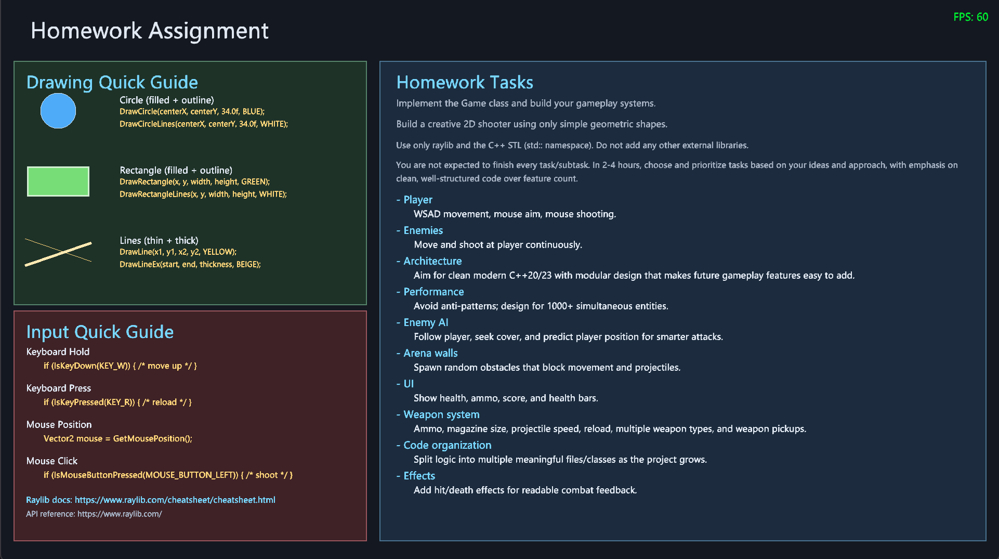
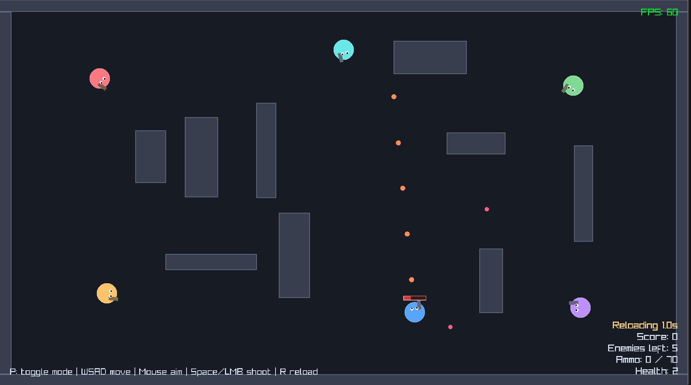
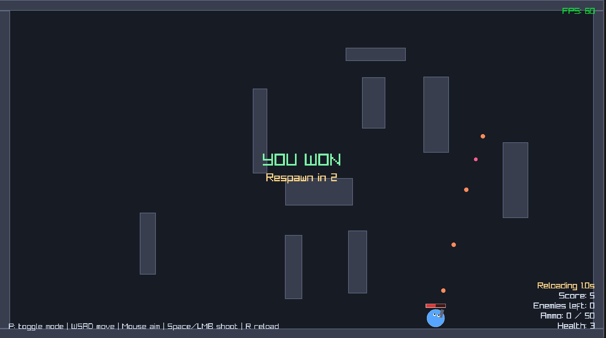

# Bagira Homework Assignment
- Build the game via `homework/build.ps1` and run it.
- The actual assignment will be displayed in the game window.
- Follow the high level structure outlined in `src/Game.cpp`.

## Homework Assignment

## Example Homework Solution

